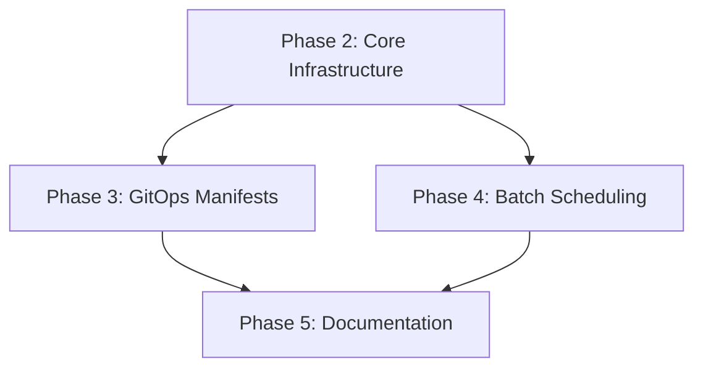

# Implementation Plan: Data Layer Enhancement with PostgREST and GitOps

**Branch**: `001-data-layer-postgrest-gitops` | **Date**: 2026-01-14 | **Spec**: [spec.md](./spec.md)
**Input**: Feature specification from `/specs/001-data-layer-postgrest-gitops/spec.md`

## Summary

Enhance the TAVR Data Infrastructure Platform with:
1. **Enhanced PostgREST API layer** - Expanded API views including data catalog endpoint for AI retrieval
2. **Data Catalog with health monitoring** - Metadata registry with freshness and quality tracking
3. **GitOps deployment via Kubernetes** - Kustomize-based manifests for ArgoCD deployment to k3s
4. **Batch scheduling** - K8s CronJobs + API trigger endpoint for data ingestion automation
5. **Enhanced docker-compose** - Full local development stack with all services

## Technical Context

**Language/Version**: Python 3.11+ (existing ingestion layer), SQL (PostgreSQL 16+)
**Primary Dependencies**: PostgREST v12.x, SQLMesh, psycopg2, Pydantic, requests
**Storage**: PostgreSQL 16 with schemas: raw, staging, mart, scoring, meta, api
**Testing**: pytest, pytest-postgresql
**Target Platform**: k3s (Kubernetes), Docker Compose (local dev)
**Project Type**: Data platform (ingestion + transformation + API)
**Performance Goals**: <500ms API response for typical queries, 50 concurrent connections
**Constraints**: GitOps-only deployments, no manual cluster modifications
**Scale/Scope**: ~5 data sources, ~20 tables, ~10 API endpoints

## Constitution Check

*GATE: Must pass before Phase 0 research. Re-check after Phase 1 design.*

> Note: Project constitution is a template (not yet configured). Proceeding with standard best practices.

- [x] No custom frameworks - using established tools (PostgREST, Kustomize, ArgoCD)
- [x] Configuration as code - all manifests in git
- [x] Tests required - pytest for Python, SQL audits via SQLMesh
- [x] Observability - health checks, data catalog with freshness metrics

## Project Structure

### Documentation (this feature)

```text
specs/001-data-layer-postgrest-gitops/
├── plan.md              # This file
├── research.md          # Phase 0 output
├── data-model.md        # Phase 1 output
├── quickstart.md        # Phase 1 output
├── contracts/           # Phase 1 output (OpenAPI specs)
└── tasks.md             # Phase 2 output (via /speckit.tasks)
```

### Source Code (repository root)

```text
src/dk_data/
├── ingestion/
│   ├── fetchers/            # Data fetchers (existing)
│   ├── sources/             # Data ingestors (existing)
│   ├── utils/               # Database utilities (existing)
│   └── batch/               # NEW: Batch job orchestration
│       ├── __init__.py
│       ├── job_runner.py    # Batch job execution
│       └── api.py           # FastAPI for job triggers
├── sqlmesh/                 # SQLMesh transformation models (existing)
├── sql/
│   ├── init_database.sql    # Schema initialization (enhance)
│   ├── api_views.sql        # API views (enhance with catalog)
│   └── catalog_functions.sql # NEW: Catalog maintenance functions
├── scripts/
│   └── catalog_refresh.py   # NEW: Catalog metadata updater
├── docker-compose.yml       # Local dev stack (enhance)
├── docker-compose.prod.yml  # NEW: Production-like local stack
└── Makefile                 # Build/run commands (enhance)

.gitops/
├── base/                    # Kustomize base manifests
│   ├── kustomization.yaml
│   ├── namespace.yaml
│   ├── postgrest/
│   │   ├── deployment.yaml
│   │   ├── service.yaml
│   │   └── configmap.yaml
│   ├── ingestion/
│   │   ├── cronjob.yaml     # Scheduled batch jobs
│   │   └── job-trigger.yaml # Job trigger service
│   └── catalog/
│       └── cronjob.yaml     # Catalog refresh job
├── overlays/
│   ├── dev/
│   │   └── kustomization.yaml
│   ├── staging/
│   │   └── kustomization.yaml
│   └── prod/
│       ├── kustomization.yaml
│       └── patches/
│           └── replicas.yaml
└── argocd/
    └── application.yaml     # ArgoCD Application manifest
```

**Structure Decision**: Extend existing `src/dk_data/` structure with new `batch/` module and `.gitops/` directory at repo root for Kubernetes manifests following Kustomize patterns.

## Complexity Tracking

> No constitution violations identified. Standard patterns used throughout.

| Component | Pattern | Justification |
|-----------|---------|---------------|
| PostgREST | Standard deployment | Industry-standard REST API for PostgreSQL |
| Kustomize | Base + overlays | GitOps best practice for environment management |
| CronJobs | K8s native | Built-in scheduling, no external dependencies |
| FastAPI | Job trigger API | Lightweight, async-ready, OpenAPI auto-generation |

## Phase 0: Research Summary

See [research.md](./research.md) for detailed findings.

### Key Decisions

| Topic | Decision | Rationale |
|-------|----------|-----------|
| API Gateway | PostgREST direct exposure | Existing pattern, auto-generates OpenAPI, row-level security built-in |
| Job Scheduling | K8s CronJobs | Native to K8s, GitOps-friendly, no external scheduler needed |
| Job Triggers | FastAPI microservice | Lightweight, can call kubectl or K8s API to create Jobs |
| Catalog Storage | PostgreSQL meta schema | Extends existing meta.data_sources pattern |
| Health Calculation | SQL function + trigger | Real-time updates on data refresh |
| Secrets | Doppler Operator | Existing assumption from spec, K8s native |

## Phase 1: Design Artifacts

### Data Model

See [data-model.md](./data-model.md) for complete schema.

**New/Enhanced Entities:**

1. **meta.data_catalog** - Enhanced catalog with semantic metadata
   - Extends existing meta.data_sources
   - Adds: topic_tags[], column_descriptions JSONB, staleness_threshold_hours

2. **meta.table_health** - Health status tracking
   - Fields: table_name, health_status, null_rate, validation_errors, checked_at

3. **meta.batch_jobs** - Job execution tracking
   - Fields: job_name, schedule, last_run, status, sources[]

### API Contracts

See [contracts/](./contracts/) directory for OpenAPI specs.

**New Endpoints:**

| Endpoint | Method | Description |
|----------|--------|-------------|
| `/catalog` | GET | Data catalog with filtering by topic, freshness |
| `/catalog/{table_name}` | GET | Single table metadata |
| `/jobs` | GET | List batch jobs and status |
| `/jobs/{job_name}/trigger` | POST | Trigger batch job on-demand |
| `/health` | GET | System health check |

### Quickstart

See [quickstart.md](./quickstart.md) for developer setup guide.

## Implementation Phases

### Phase 2: Core Infrastructure (Tasks T001-T010)

1. Enhanced docker-compose with full PostgreSQL + PostgREST + ingestion services
2. Database schema updates for catalog and health tracking
3. SQL functions for health calculation
4. Catalog refresh script

### Phase 3: GitOps Manifests (Tasks T011-T020)

1. Kustomize base manifests for PostgREST
2. CronJob manifests for batch ingestion
3. Environment overlays (dev/staging/prod)
4. ArgoCD Application manifest

### Phase 4: Batch Scheduling (Tasks T021-T030)

1. Batch job runner module
2. FastAPI job trigger service
3. K8s Job templates for each data source
4. Integration with existing fetchers

### Phase 5: Documentation & Testing (Tasks T031-T040)

1. Update ARCHITECTURE.md
2. API validation tests
3. GitOps deployment test
4. Quickstart documentation

## Dependencies



## Risk Mitigation

| Risk | Mitigation |
|------|------------|
| PostgREST connection issues in K8s | Use internal service DNS, health checks |
| CronJob failures undetected | Job success/failure webhooks, Slack alerts |
| Catalog stale after deployment | Post-sync hook to refresh catalog |
| Large dataset timeouts | Configurable batch sizes, retry logic |

## Next Steps

Run `/speckit.tasks` to generate the detailed task breakdown from this plan.
