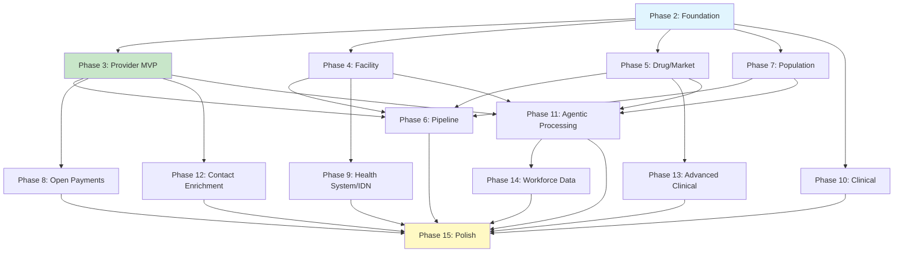

# Implementation Plan: CMS PUF Data Source Integration

**Branch**: `016-cms-puf-datasource-integration` | **Date**: 2026-03-01 | **Spec**: [spec.md](./spec.md)
**Input**: Feature specification from `/specs/016-cms-puf-datasource-integration/spec.md`

## Summary

Integrate ~54 free CMS/FDA/NLM/BLS/SEC public-use files and APIs to replace $232K–$818K/yr in vendor data (IQVIA, Definitive Healthcare, Komodo Health, Veeva). This feature extends the existing medallion pipeline (raw → bronze → silver → gold) with provider, facility, drug-market, population, clinical, and contact enrichment data sources. It introduces a dual-ingestion architecture (MCP tools for real-time + batch data loaders for CronJob) feeding shared raw tables, plus a Claude SDK agentic processing pipeline for 6 inference agents (service line inference, IDN hierarchy, referral networks, contact verification, staffing decomposition, equipment inventory). Gold-layer profiles are exposed via PostgREST with analyst JWT authentication. Estimated product coverage from free data: HCP Compass ~80%, HCO Navigator ~90%, Lumina ~50%, SageAI ~75%. Estimated engineering effort: ~20-27 weeks.

## Technical Context

**Language/Version**: Python 3.11+ (existing codebase), SQL (PostgreSQL 16.4)
**Primary Dependencies**: FastAPI >=0.109.0, SQLMesh >=0.90.0, psycopg2-binary >=2.9.9, asyncpg >=0.29.0, httpx >=0.25.0, Pydantic >=2.5.0, structlog >=24.0.0, prometheus-client >=0.19.0, litellm (LLM proxy client — replaces direct anthropic SDK for agents), PostgREST v12.2.3
**Storage**: PostgreSQL 16.4 via CloudNativePG (`postgresql.infra.svc.cluster.local:5432`, database `dk_data`). Schemas: `raw`, `bronze`, `silver`, `gold` (new exposure), `meta`, `mol_raw`, `mol_bronze`, `mol_silver`, `mol_gold`, `xenon`, `api`, `mol_api`. Range partitioning for high-volume tables (Part D, Physician PUF).
**Testing**: pytest with `@responses.activate` mocking, contract tests for SQLMesh models, integration tests with `@pytest.mark.integration`, psycopg2 fixtures with auto-rollback
**Target Platform**: Linux server (Kubernetes cluster), CloudNativePG PostgreSQL, GitHub Actions CI
**Project Type**: Single project — Python backend with SQL migrations and K8s manifests
**Performance Goals**: MCP tool invocations < 3s (cached) / < 8s (cold). Annual PUF ingestion (25M Part D rows) completes within 4 hours. Gold PostgREST queries < 500ms.
**Constraints**: No OOM on 25M-row annual loads (batch inserts with 10K commit interval). Backward-compatible with existing 28 MCP tools. Agent processing budget ~$170-380/month (Haiku). CMS Socrata API rate limit ~10K req/sec (documented), practical sustained ~1-5K req/sec. NPPES V2 CSV format transition mandated 2026-03-03.
**Scale/Scope**: 8M+ NPIs, 4K+ hospitals, 5K+ drugs, 250M+ historical Part D rows, 100M+ Physician PUF rows. 4 downstream products (HCP Compass, HCO Navigator, Lumina, SageAI).

## Constitution Check

*GATE: Must pass before Phase 0 research. Re-check after Phase 1 design.*

The project constitution (`/.specify/memory/constitution.md`) is a placeholder template with no active principles defined. No gates to evaluate. Proceeding to Phase 0.

**Pre-design check**: PASS (no active constitution constraints)
**Post-design re-check**: PASS (no active constitution constraints)

## Project Structure

### Documentation (this feature)

```text
specs/016-cms-puf-datasource-integration/
├── spec.md              # Feature specification (complete)
├── plan.md              # This file (/speckit.plan command output)
├── research.md          # Phase 0 output (/speckit.plan command)
├── data-model.md        # Phase 1 output (/speckit.plan command)
├── quickstart.md        # Phase 1 output (complete)
├── contracts/           # Phase 1 output (/speckit.plan command)
│   ├── mcp-tools.yaml   # MCP tool contracts (OpenAPI-style)
│   ├── postgrest-gold.yaml  # PostgREST gold schema contracts
│   └── agent-pipeline.yaml  # Agent I/O contracts
└── tasks.md             # Phase 2 output (/speckit.tasks command - NOT created by /speckit.plan)
```

### Source Code (repository root)

```text
src/
├── dk_data/
│   ├── api/routes/
│   │   └── mcp.py                     # MODIFY: ToolInvokeRequest — make drug_name Optional, add npi/ccn/params (Audit §A)
│   ├── services/mcp/
│   │   ├── base_tool.py               # MODIFY: generic param handling (Audit §B)
│   │   ├── tool_registry.py           # MODIFY: +~40 ToolDefinitions (Tiers 4-6) (Audit §D)
│   │   ├── bronze_transformer.py      # MODIFY: +~35 handlers
│   │   ├── silver_gold_refresher.py   # MODIFY: provider/facility refresh (Audit §C)
│   │   └── adapters/
│   │       ├── base.py                # MODIFY: build_url() backward-compat
│   │       ├── nppes.py               # NEW
│   │       ├── cms_partd_prescribers.py   # NEW
│   │       ├── cms_open_payments.py   # NEW
│   │       ├── cms_hospital_quality.py    # NEW
│   │       ├── fda_ndc.py             # NEW
│   │       ├── cms_inpatient_puf_summary.py  # NEW
│   │       ├── nlm_rxnorm.py          # NEW
│   │       ├── pbm_formulary.py       # NEW
│   │       ├── pharmgkb.py            # NEW
│   │       └── ... (~30 more)         # NEW
│   ├── ingestion/
│   │   ├── main.py                    # MODIFY: +~35 SOURCES entries
│   │   ├── fetchers/
│   │   │   ├── __init__.py            # MODIFY: export new classes
│   │   │   ├── cms_socrata_base.py    # NEW: shared Socrata base
│   │   │   ├── nppes.py              # NEW
│   │   │   ├── bls_oews.py           # NEW
│   │   │   ├── state_apcd.py         # NEW
│   │   │   └── ... (~30 more)        # NEW
│   │   └── sources/
│   │       ├── __init__.py            # MODIFY: export new loaders
│   │       ├── nppes.py              # NEW
│   │       └── ... (~30 more)        # NEW
│   ├── claude_sdk/
│   │   ├── __init__.py               # MODIFY: export BaseAgent + agents
│   │   ├── base_agent.py             # NEW: BaseAgent ABC (reuses enrichment.py + scoring_agent.py patterns)
│   │   ├── agent_registry.py         # NEW: AgentDefinition registry (mirrors tool_registry.py)
│   │   ├── runner.py                 # NEW: CLI entry point for CronJobs
│   │   └── agents/
│   │       ├── __init__.py           # NEW
│   │       ├── service_line_inference.py   # NEW
│   │       ├── idn_hierarchy.py      # NEW
│   │       ├── referral_network.py   # NEW
│   │       ├── contact_verification.py    # NEW
│   │       ├── staffing_decomposition.py  # NEW
│   │       └── equipment_inventory.py     # NEW
│   ├── config/
│   │   ├── cms_datasets.py           # NEW: shared CMS Socrata dataset ID constants (Audit §0.5)
│   │   └── rate_limits.yaml          # MODIFY: +~45 rate limits
│   ├── sqlmesh/models/molecules/
│   │   ├── bronze/
│   │   │   ├── cms_nppes.sql         # NEW
│   │   │   ├── cms_part_d_prescribers.sql   # NEW
│   │   │   └── ... (~23 more)        # NEW
│   │   ├── silver/
│   │   │   ├── healthcare_facilities.sql  # MODIFY: schema evolution provider_id→ccn (Audit §E)
│   │   │   ├── providers.sql         # NEW
│   │   │   ├── prescribing_profiles.sql    # NEW
│   │   │   ├── procedure_profiles.sql      # NEW
│   │   │   ├── drug_market.sql       # NEW
│   │   │   ├── geographic_analytics.sql    # NEW
│   │   │   └── ... (10 more)         # NEW
│   │   └── gold/
│   │       ├── provider_profile.sql  # NEW
│   │       ├── facility_profile.sql  # NEW
│   │       ├── drug_market_profile.sql     # NEW
│   │       ├── market_analytics.sql  # NEW
│   │       └── provider_network.sql  # NEW
│   ├── sql/migrations/
│   │   ├── 083_cms_puf_foundation.sql          # NEW: silver/gold entity + reference tables + agent infra
│   │   ├── 084_provider_raw_bronze_tables.sql  # NEW: Phase 2 (7 sources, range partitioning)
│   │   ├── 085_facility_raw_bronze_tables.sql  # NEW: Phase 3 (10 sources)
│   │   ├── 086_drug_market_raw_bronze_tables.sql   # NEW: Phase 4 (9 sources)
│   │   ├── 087_population_clinical_raw_bronze_tables.sql  # NEW: Phases 5-6
│   │   └── 088_advanced_clinical_contact_tables.sql       # NEW: Phases 7-9
│   ├── sql/seed_data_sources.sql     # MODIFY: +~45 catalog entries
│   └── observability/metrics.py      # MODIFY: provider/facility/agent metrics
├── k8s/
│   ├── base/
│   │   ├── postgrest/configmap.yaml  # MODIFY: add "gold" to PGRST_DB_SCHEMAS
│   │   ├── kustomization.yaml        # MODIFY: add ~48 CronJob resources
│   │   └── ingestion/
│   │       ├── cronjob-fetch-nppes.yaml      # NEW
│   │       ├── cronjob-fetch-cms-partd.yaml  # NEW
│   │       ├── cronjob-agent-service-line.yaml   # NEW
│   │       └── ... (~44 more)        # NEW
│   └── overlays/staging/             # Existing overlay
└── tests/
    ├── test_cms_puf_adapters.py      # NEW
    ├── test_cms_puf_fetchers.py      # NEW
    ├── test_cms_puf_loaders.py       # NEW
    ├── test_cms_puf_bronze_contracts.py   # NEW
    ├── test_cms_puf_silver_contracts.py   # NEW
    └── test_agents/
        ├── test_service_line_inference.py  # NEW
        ├── test_idn_hierarchy.py     # NEW
        └── test_base_agent.py        # NEW
```

**Structure Decision**: Single project extending the existing `src/dk_data/` Python package. All new code follows established module layout: adapters in `services/mcp/adapters/`, fetchers in `ingestion/fetchers/`, loaders in `ingestion/sources/`, SQLMesh models in `sqlmesh/models/molecules/`, agents in `claude_sdk/agents/`. No new top-level directories. ~220 new files, ~18 modified files across 15 implementation phases. Integration audit identified 5 critical existing-file changes (see spec.md § Integration Audit).

## Complexity Tracking

> No Constitution Check violations to justify. The constitution is a placeholder template.

| Violation | Why Needed | Simpler Alternative Rejected Because |
|-----------|------------|-------------------------------------|
| N/A | N/A | N/A |

## Phase 0: Research Summary

See [research.md](./research.md) for detailed findings (10 research tasks with decision rationale).

### Key Decisions

| Topic | Decision | Rationale |
|-------|----------|-----------|
| CMS Socrata API | V1 data-api + bulk CSV, ~10K req/sec documented (1-5K sustained) | Drives `CMSSocrataFetcher` base class design |
| NPPES 9.3 GB CSV | pandas `chunksize=50000`, streaming download, resume-on-failure | Memory-safe ingestion under 512 MB |
| Range Partitioning | `PARTITION BY RANGE (year)` for Part D + Physician PUF raw+bronze tables | Query performance + annual partition-swap refresh |
| Entity Resolution | NPI canonical key, NPPES authoritative, `source_precedence ASC` | Simple deterministic lookup — no fuzzy matching needed |
| Agentic Processing | `BaseAgent` ABC, monthly CronJobs, Haiku `claude-haiku-4-5-20251001` via LiteLLM proxy, 3-tier validation | Cost control ($170-380/mo) + unified LLM access via `litellm.infra.svc.cluster.local:4000` |
| PostgREST Gold | Add `gold` to `PGRST_DB_SCHEMAS`, analyst-only JWT access | Downstream product API exposure |
| Open Payments API | Separate API endpoint, `CMSSocrataFetcher`-compatible pagination | MCP tool + batch support |
| DDInter/Stabilis | Full dataset cache, offline mode, quarterly refresh | Reliability for academic APIs |
| IDN Hierarchy | 3-stage (deterministic → heuristic → agent, ~80/20 split) | Automates 80%, agent handles ambiguous 20% |
| Freshness Monitoring | Existing `dk_data_source_*` metrics auto-cover new sources | No new observability infra needed |
| Ontology Extension | PostgreSQL lookup tables, NOT ontology YAML | DRG/HCPCS/NUCC are structured reference data (see spec § Ontology Assessment) |
| Model Selection | Haiku for new agents (vs existing Sonnet) | Higher volume, lower complexity tasks — $0.80/$4 vs $3/$15 per 1M tokens |

### Integration Audit Summary

A comprehensive codebase audit identified 5 critical integration points, 11 reuse opportunities, and 12 pattern compliance rules. Full details in [spec.md § Integration Audit](./spec.md#integration-audit--drift--duplication-prevention).

**Critical integration points** (must-fix before implementation):

| ID | Issue | File | Fix |
|----|-------|------|-----|
| §A | `ToolInvokeRequest` requires `drug_name` | `api/routes/mcp.py:45-48` | Make Optional, add `npi`/`ccn`/`params` + `@model_validator` |
| §B | `_fetch_external()` hardcodes `drug_name` | `services/mcp/base_tool.py:143` | Generic primary_query extraction from params dict |
| §C | `SilverGoldRefresher` molecule-only | `services/mcp/silver_gold_refresher.py` | Add `refresh_provider()`, `refresh_facility()` + source category dispatch |
| §D | `ToolDefinition.input_schema` defaults to `drug_name` required | `services/mcp/tool_registry.py:26-33` | New tools override `input_schema` per-tool |
| §E | `silver.healthcare_facilities` PK change | `sqlmesh/models/molecules/silver/healthcare_facilities.sql` | Schema evolution from `(provider_id, source)` → `ccn` |

## Phase 1: Design Artifacts

### Data Model

See [data-model.md](./data-model.md) for complete schema (11 entities, relationships, validation rules, state transitions).

**Entities**:

| # | Entity | PK | Layers | Key Sources |
|---|--------|-----|--------|-------------|
| 1 | Provider | `npi` | raw → bronze → silver → gold | NPPES, Care Compare, Physician PUF, Part D, Open Payments |
| 2 | Facility | `ccn` | raw → bronze → silver → gold | POS, Hospital Quality, ANCC Magnet, Inpatient PUF |
| 3 | Prescribing Profile | `(npi, drug_name, year)` | raw → bronze → silver | Part D Prescribers |
| 4 | Procedure Profile | `(npi, hcpcs_code, year)` | raw → bronze → silver | Physician PUF |
| 5 | Open Payments | `record_id` | raw → bronze → silver | CMS Open Payments |
| 6 | Health System (IDN) | `organization_npi` | raw → bronze → silver | PECOS + CHOW + Facility Affiliation |
| 7 | Drug Market | `(drug_name, year)` | raw → bronze → silver → gold | Part D/B Spending, NDC, Formulary, USP, RBCS |
| 8 | Geographic Analytics | `(geo_level, geo_code, year)` | raw → bronze → silver → gold | Geographic Variation, Chronic Conditions |
| 9 | Provider Network | `(source_npi, dest_npi, relationship_type)` | gold (agent-produced) | ReferralNetworkAgent |
| 10 | Agent Execution Log | `id` | meta | All agents |
| 11 | Agent Quarantine | `id` | meta | Low-confidence agent outputs |

**Reference Tables** (3, in migration 083 — ontology replacement):
- `silver.drg_service_line_mapping` — 772 DRGs → ~30 service lines
- `silver.hcpcs_equipment_mapping` — HCPCS codes → equipment categories
- `silver.nucc_taxonomy` — ~900 NUCC codes → specialty descriptions

### API Contracts

See [contracts/](./contracts/) directory for OpenAPI-style specs.

**MCP Tool Contracts** ([mcp-tools.yaml](./contracts/mcp-tools.yaml)):

| Tier | Category | Tools | Key Params |
|------|----------|-------|------------|
| Tier 4 | `provider_claims` | NPPES, Part D, Part D Summary, Physician PUF, Physician Summary, Open Payments, Care Compare (7) | npi, drug_name, hcpcs_code |
| Tier 5 | `facility_hospital` | POS, PECOS, CHOW, Affiliation, Inpatient Detail, Outpatient, Quality, DRG Weights, Magnet, HCPCS (10) | ccn, drg_code, hcpcs_code |
| Tier 6 | `drug_market_population` | NDC, Part D/B Spending, Formulary, RBCS, Price Lookup, USP, NUCC, Geographic, Chronic, Post-Acute, DMEPOS, DDInter, Stabilis (13) | drug_name, hcpcs_code, geo_code |

**PostgREST Gold Contracts** ([postgrest-gold.yaml](./contracts/postgrest-gold.yaml)):

| Endpoint | Product | Key Filters |
|----------|---------|-------------|
| `GET /gold/provider_profile` | HCP Compass | `?npi=eq.X` |
| `GET /gold/facility_profile` | HCO Navigator | `?ccn=eq.X` |
| `GET /gold/drug_market_profile` | Lumina | `?drug_name=eq.X` |
| `GET /gold/market_analytics` | SageAI | `?geo_code=eq.X&year=eq.Y` |
| `GET /gold/provider_network` | All products | `?source_npi=eq.X&confidence_score=gte.0.50` |

**Agent Pipeline Contracts** ([agent-pipeline.yaml](./contracts/agent-pipeline.yaml)):

| Agent | Input Tables | Output Table | Model | Validation |
|-------|-------------|-------------|-------|------------|
| ServiceLineInference | bronze.cms_inpatient_puf_detail + bronze.cms_provider_of_services | silver.facility_service_lines | Haiku | Volume sums ≈ DRG totals |
| IDNHierarchy | bronze.cms_pecos + bronze.cms_chow + bronze.cms_facility_affiliation | silver.health_systems | Haiku | Top 50 US systems cross-ref |
| ReferralNetwork | silver.providers + Post-Acute PUFs + DMEPOS + PECOS | gold.provider_network | Haiku | confidence ≥ 0.50 for gold |
| ContactVerification | silver.providers + Google Places + USPS | UPDATE silver.providers | N/A (API) | Status: verified/unverified/mismatch |
| StaffingDecomposition | raw.cms_cost_reports + BLS OEWS | silver facilities enrichment | Haiku | Decomposition sums ± 2% FTE |
| EquipmentInventoryInference | silver.healthcare_facilities + bronze.cms_hcpcs + bronze.cms_outpatient_puf | silver.equipment_inventory | Haiku | HCPCS procedure volume validation |

### Quickstart

See [quickstart.md](./quickstart.md) for developer setup guide covering: environment setup, database migrations (083-088), SQLMesh model compilation, MCP tool testing, PostgREST gold schema verification, agent runner dry-run, and CronJob deployment.

## Implementation Phases

### Phase 1: Setup (Tasks T001-T005)

Verify prerequisites and branch setup.

1. Verify Python 3.11+, PostgreSQL 16.4 connectivity, PostgREST, uv
2. Validate existing MCP tool count (28 tools), existing fetcher count, existing SQLMesh models
3. Run existing test suite to confirm green baseline
4. Review Integration Audit critical points (§A-§E) against current codebase

### Phase 2: Foundation (Tasks T006-T025)

No source dependencies — enables all subsequent phases.

1. Migration 083: silver entity tables (9) + reference tables (3) + gold tables (5) + agent infra (2) + RBAC
2. `api/routes/mcp.py`: `ToolInvokeRequest` generic params (Audit §A)
3. `base_tool.py`: generic param handling — `primary_query` extraction (Audit §B)
4. `adapters/base.py`: `build_url()` backward-compatible update
5. `silver_gold_refresher.py`: `refresh_provider()`, `refresh_facility()`, source category dispatch (Audit §C)
6. `BaseAgent` + `AgentRegistry` + `Runner` CLI
7. `config/cms_datasets.py`: shared CMS Socrata dataset ID constants
8. `CMSSocrataFetcher` base class
9. PostgREST configmap: add `gold` to `PGRST_DB_SCHEMAS`
10. `observability/metrics.py`: add entity-level Prometheus gauges

### Phase 3: Provider & Claims MVP (Tasks T026-T055)

User Stories 1+2 (Provider Lookup, Provider Search). Parallelizable per-source.

1. Migration 084: raw + bronze for 7 sources (Part D/Physician PUF with range partitioning)
2. 7 MCP adapters + 5 fetchers + 5 loaders (parallel)
3. 7 bronze SQLMesh models
4. 4 silver models: `providers`, `prescribing_profiles`, `procedure_profiles`, `open_payments`
5. 1 gold model: `provider_profile`
6. Tool registry Tier 4 entries (7 tools)
7. Bronze transformer handlers (7)
8. 5 CronJobs (per spec.md § CronJob Manifest Template) + rate limits + catalog seeds

### Phase 4: Facility & Hospital (Tasks T056-T085)

User Story 3 (Facility Profile). 10+1 sources including Inpatient Summary PUF.

1. Migration 085: raw + bronze for 10 facility sources
2. 10 adapters + 10 fetchers + 10 loaders
3. 10 bronze models
4. 3 silver models: `healthcare_facilities` (schema evolution §E), `health_systems`, `facility_service_lines`
5. 1 gold model: `facility_profile`
6. Tool registry Tier 5 entries (10 tools)

### Phase 5: Drug & Market (Tasks T086-T110)

User Story 4 (Drug Market Analysis). 9+1 sources including RxNorm bulk.

1. Migration 086: raw + bronze for 9 drug/market sources
2. 9 adapters + 9 fetchers + 9 loaders
3. 9 bronze models
4. 1 silver model: `drug_market`
5. 1 gold model: `drug_market_profile`
6. Tool registry Tier 6 entries (13 tools)

### Phase 6: Pipeline Automation (Tasks T111-T125)

User Story 9 (Bulk Data Refresh Pipeline). CronJob orchestration for all sources.

1. ~33 CronJob manifests for data sources — all follow spec.md § CronJob Manifest Template: individual `secretKeyRef` per DB key (NOT `envFrom`), `imagePullSecrets: ghcr-credentials`, K8s recommended labels, OTEL static values, image `ghcr.io/data-kinetic/dk-data-fe/job-trigger` (exact name for kustomize image transformer)
2. `kustomization.yaml` updates — add all new CronJob resources
3. K8s manifest validation — `kubectl kustomize k8s/overlays/staging --enable-helm > /dev/null`
4. Rate limits for all sources
5. Catalog seeds for all sources
6. Deployment: CronJobs deploy automatically after merge to `staging` branch via ArgoCD auto-sync (`build-push.yaml` → image build → auto-commit tag → ArgoCD sync to `dk-data-staging` namespace). DopplerSecret project: `dk-data-fe`.

### Phase 7: Population & Geographic (Tasks T126-T140)

User Story 5 (Geographic Market Analytics). 4 population sources.

1. Migration 087: raw + bronze for population + clinical sources
2. 4 adapters + 4 fetchers + 4 loaders
3. 4 bronze models
4. 1 silver model: `geographic_analytics`
5. 1 gold model: `market_analytics`

### Phase 8: Open Payments Detail (Tasks T141-T150)

User Story 6 (Open Payments Transparency). Enhance existing adapter + refresher.

1. Enhance Open Payments adapter for detailed queries
2. Silver handler for payment categorization (general/research/ownership)
3. Gold handler for aggregate totals by year/payer/type

### Phase 9: Health System/IDN (Tasks T151-T165)

User Story 7 (Health System Hierarchy). IDN hierarchy agent + SEC EDGAR reference.

1. IDNHierarchy agent implementation
2. CHOW mid-year ownership logic
3. SEC EDGAR cross-reference for public systems
4. Top 50 US health systems validation baseline

### Phase 10: Clinical Sources (Tasks T166-T180)

User Story 8 (Drug Interaction Check). DDInter, Stabilis, Medicaid PDL, RSS extensions.

1. DDInter 2.0 fetcher + adapter (offline-capable cache)
2. Stabilis 4.0 fetcher + adapter
3. Medicaid PDL fetcher + adapter
4. RSS feed extensions (Becker's, FierceHealthcare, Google News, Modern Healthcare)

### Phase 11: Agentic Processing (Tasks T181-T210)

5 remaining agents (ServiceLine already partially done in Phase 9).

1. ServiceLineInference agent + CronJob (512Mi/500m, 4h deadline)
2. ReferralNetwork agent + CronJob (1Gi/1000m, 8h deadline)
3. ContactVerification pipeline + CronJob (256Mi/250m, 4h deadline)
4. StaffingDecomposition agent + CronJob
5. EquipmentInventoryInference agent + CronJob
6. 6 agent CronJob manifests following agent variant of spec.md § CronJob Manifest Template: `command: ["python", "-m", "dk_data.claude_sdk.runner"]`, `args: ["--agent", "{name}", "--batch-size", "N"]`. `LITELLM_API_BASE` as static `value:` (cluster-internal URL, NOT from DopplerSecret). ContactVerification uses `GOOGLE_PLACES_API_KEY` + `USPS_API_KEY` via `secretKeyRef` instead. All include standard 5 DB `secretKeyRef` entries + OTEL static values + `imagePullSecrets: ghcr-credentials`.

### Phase 12: Contact Enrichment (Tasks T211-T225)

Provider address geocoding, insurer directories, PubMed emails, ORCID.

1. NPPES address geocoding (Nominatim/Google free tier)
2. Insurer provider directory cross-reference (Aetna/BCBS/UHC)
3. PubMed author email extraction
4. ORCID pipeline re-enablement

### Phase 13: Advanced Clinical (Tasks T226-T245)

Migration 088. Drug-allergy, dose ranges, off-label, pharmacogenomics, alert rules.

1. Migration 088: raw + bronze + silver for Phases 12-14
2. Drug-allergy cross-sensitivity (PharmGKB + ATC + ChEMBL)
3. DailyMed SPL dose range extraction (enable existing Tier 3)
4. PSYHAMM/HeTOP off-label indications
5. ONCHigh/Phansalkar alert rules + FAERS signals
6. PharmGKB pharmacogenomics

### Phase 14: Conference & Workforce Data (Tasks T246-T265)

Conference abstracts, PBM formularies, State APCD framework, BLS OEWS, DE-SynPUF.

1. Conference abstract ingestion (ASCO/AHA/ESMO/ASH) + NPI linking
2. PBM public formularies (CVS/Express/Optum)
3. State APCD framework + 2-3 pilot states
4. BLS OEWS occupational data (staffing agent input)
5. CMS DE-SynPUF synthetic claims (one-time load for dev/test)

### Phase 15: Polish & Validation (Tasks T266-T280)

Integration testing, backward compatibility verification, cleanup.

1. End-to-end pipeline test: raw → bronze → silver → gold → PostgREST
2. Backward compatibility: all 28 existing MCP tools unchanged
3. SQLMesh model compilation validation
4. K8s manifest validation
5. Prometheus metrics verification
6. Load testing for gold PostgREST queries
7. Agent dry-run validation
8. Documentation updates

## Dependencies



**Critical path**: Phase 2 → Phase 3 → Phase 11 → Phase 15

**Parallel tracks** (after Phase 2 completes):
- Track A: Phases 3 → 8 → 12 (Provider pipeline)
- Track B: Phases 4 → 9 (Facility pipeline)
- Track C: Phases 5 → 13 (Drug/Market pipeline)
- Track D: Phases 7 → 10 (Population/Clinical pipeline)
- Track E: Phase 11 (Agentic — needs A+B+C+D)

## Risk Mitigation

| Risk | Impact | Probability | Mitigation |
|------|--------|-------------|------------|
| NPPES V2 format change (2026-03-03) | High — NPPES fetcher breaks | High | V2 format detection in fetcher, test with V2 files before deployment |
| CMS API rate limiting during bulk load | Medium — slow initial backfill | Medium | Prefer bulk CSV download for initial historical load; API for incremental updates |
| 25M Part D rows cause OOM | High — pipeline failure | Low | Range partitioning + batch inserts (10K commit) + 512Mi container limit |
| Academic API downtime (DDInter/Stabilis) | Medium — MCP tool unavailable | Medium | Offline mode with full dataset cache; quarterly refresh |
| Agent cost overrun (>$400/month) | Low — budget concern | Low | Haiku pricing + deterministic pre-filter (80% of service line inference is rule-based) |
| `healthcare_facilities` schema evolution breaks existing data | Medium — data loss | Low | CCN values already present as provider_id in CMS sources; migration handles transition |
| Health system M&A during year | Low — incorrect hierarchy | Medium | Temporal ownership rules per CHOW dates; agent resolves ambiguous cases |
| 28 existing MCP tools regress | High — production impact | Low | Integration audit ensured backward-compat; `drug_name` callers unchanged |
| PBM formulary format changes | Low — one source affected | Medium | Graceful degradation with format detection; quarterly refresh allows manual fix |
| State APCD DUA delays | Low — pilot-only scope | High | Framework first; 2-3 pilot states initially; DUA process started early |

## Verification

```bash
# 1. Validate SQLMesh models compile
cd src && python -m sqlmesh plan --no-prompts

# 2. Run tests
pytest tests/test_cms_puf_*.py tests/test_agents/ -v

# 3. Validate k8s manifests
kubectl kustomize k8s/overlays/staging --enable-helm > /dev/null

# 4. Test MCP tool count (expected: ~68)
python -c "from dk_data.services.mcp.tool_registry import TOOL_REGISTRY; print(f'Tools: {len(TOOL_REGISTRY)}')"

# 5. Test NPI lookup via MCP
curl -X POST http://localhost:8000/api/v1/mcp/tools/nppes-search/invoke \
  -H "Content-Type: application/json" -H "Authorization: Bearer $JWT" \
  -d '{"npi": "1234567890"}'

# 6. Test PostgREST gold access
curl -H "Authorization: Bearer $JWT" \
  http://localhost:3000/gold/provider_profile?npi=eq.1234567890

# 7. Verify catalog entries
curl -H "Authorization: Bearer $JWT" \
  http://localhost:3000/api/catalog?source_name=like.*cms*

# 8. Check metrics
curl http://localhost:8000/api/v1/monitoring/metrics | grep dk_providers_total

# 9. Test agent runner
python -m dk_data.claude_sdk.runner --agent service_line_inference --dry-run

# 10. Verify agent registry (expected: 6)
python -c "from dk_data.claude_sdk.agent_registry import AGENT_REGISTRY; print(f'Agents: {len(AGENT_REGISTRY)}')"
```

## Next Steps

Run `/speckit.tasks` to generate the detailed task breakdown from this plan. Tasks file: [tasks.md](./tasks.md).
